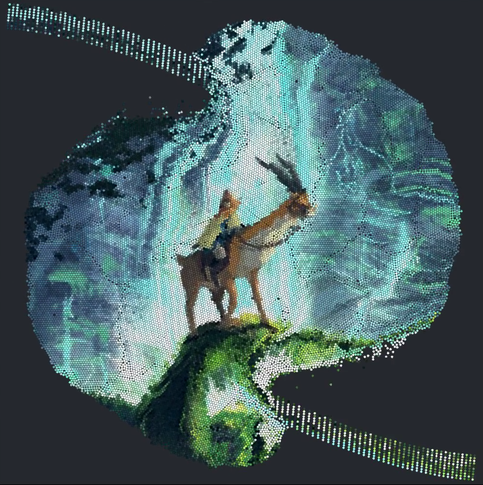
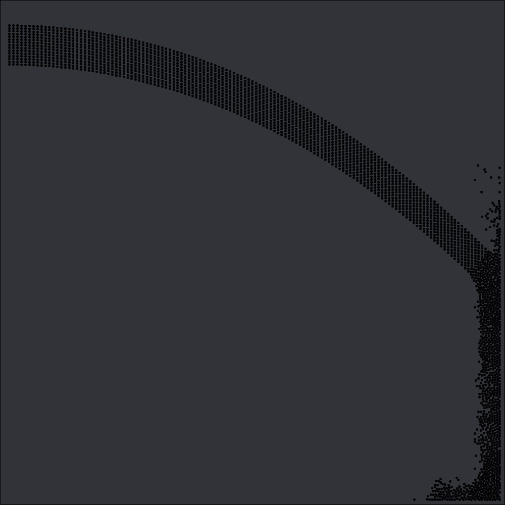
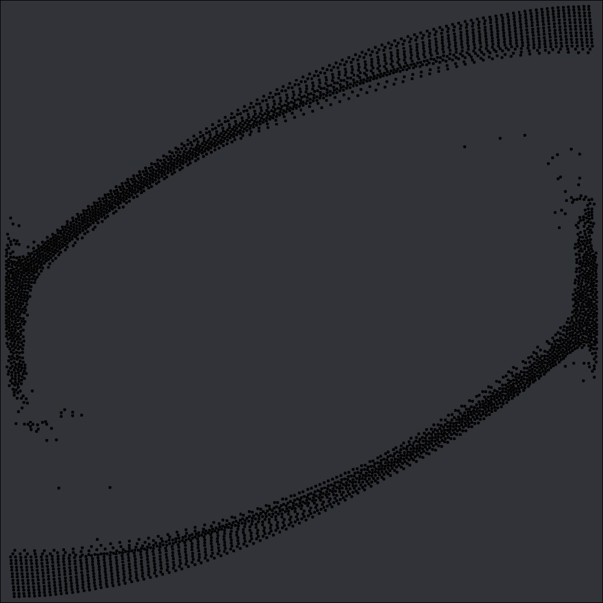
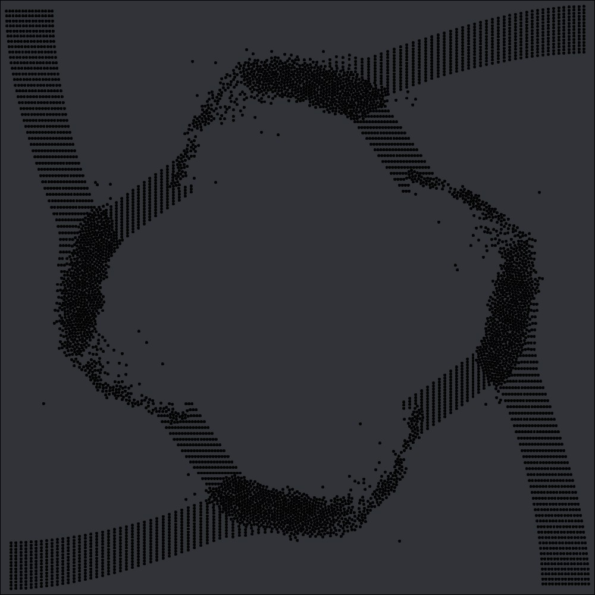

# Verlet Multi thread

## USAGE AND OPTIONS
Launch: `Verlet-Multithread [OPTIONS]`

### Options:
```
-ff PATH               Path to ffmpeg (by default "ffmpeg.exe").
-i  PATH               Path to the image that you want to animate.
-ww WIDTH              Width of world (by default 200).
-wh HEIGHT             Height of world (by default 200).
-c  CIRCLES            Maximum number of circles (by default 26000). It takes about
                       WIDTH * HEIGHT to fill a full window.
-d                     Disable the image destruction stage.
-dr FRAMES             The number of delay frames before changing the flow of circles
                       (by default 120).
-dd FRAMES             The number of delay frames before destruction (by default 60).
-p  NUMBER             The preset number takes values from 0 to 2 (default is 2).
                       You can see the description below.
-n  NUMBER             Number of circular emitters (on each side), by default 15.
-s  STEP  (float)      The step of increasing the number of emitters per frame
                       (default is 0). Values less than 0.2 are recommended.
-g  NUMBER             The gravity number takes values from 0 to 2 (default is 1).
                       You can see the description below.
-gf FORCE (float)      Gravity force, recommended values are given in the section of 
                       gravity.
-f  FPS                FPS of the output video.
```

### Presets:
The preset 0 with gravity 0 and force 40:



The preset 1 with gravity 1 and force 1:



The preset 2 with gravity 1 and force 1:



### Gravity:
Gravity 0 is the usual gravitational force. The standard strength value is 20 or more.

Gravity 1 is the force of attraction to the center of the window, and the further away the object is from the center, the more strongly it attracts. The standard force value is 1.

Gravity 2 is the force of attraction to the center of the window, which evenly affects all objects. However, usually the result at gravity 1 is better, choose this option only if 1 does not suit you. The standard strength value is 100-200.

## Compilation

[FFMPEG](https://ffmpeg.org/) and [CMake](https://cmake.org/) need to be installed.

Create a `build` directory

```bash
mkdir build
cd build
```

**Configure** and **build** the project

```bash
cmake ..
cmake --build .
```

On **Windows** it will build in **debug** by default. To build in release you need to use this command

```bash
cmake --build . --config Release
```

You will also need to add the `res` directory and the SFML dlls in the Release or Debug directory for the executable to run.
